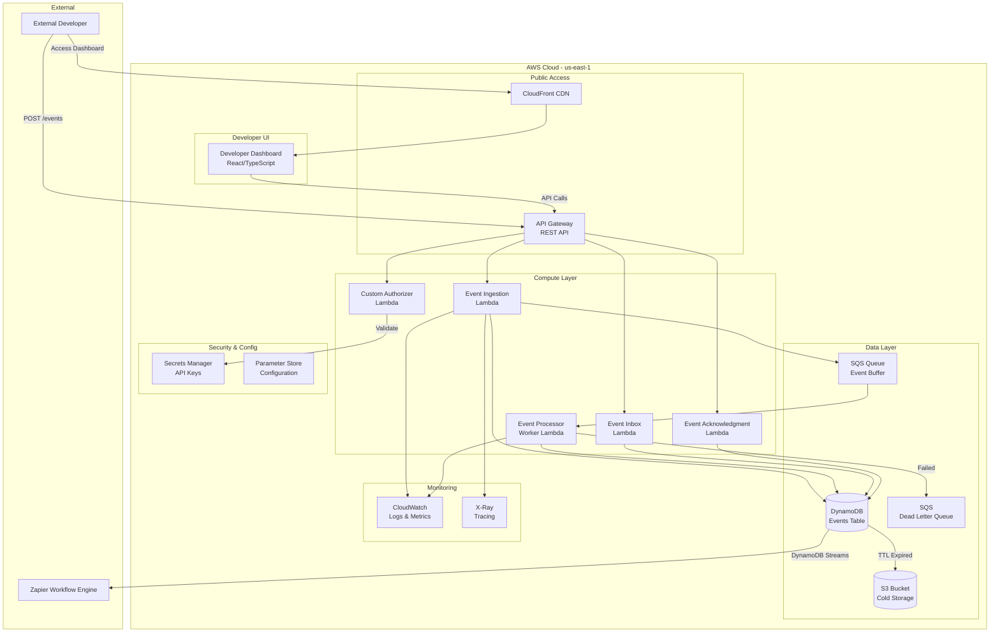
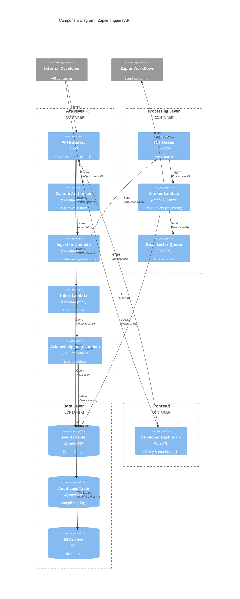
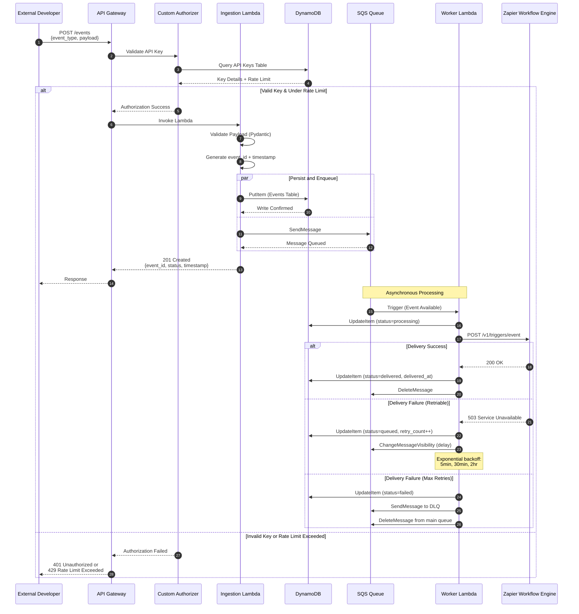
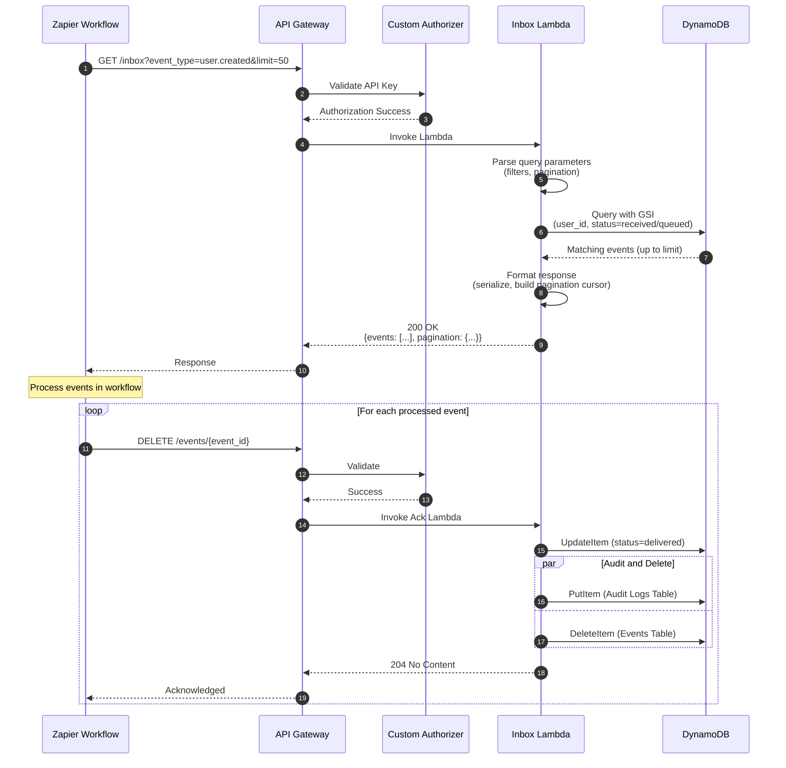
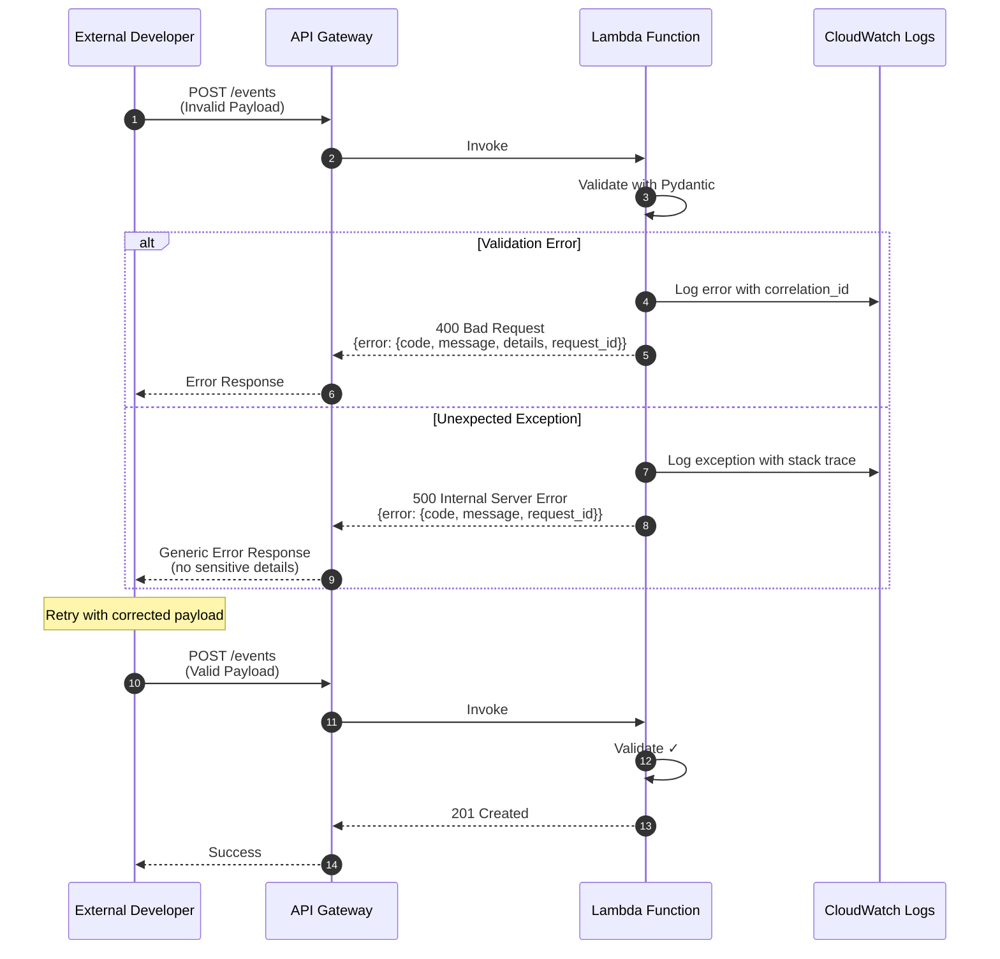
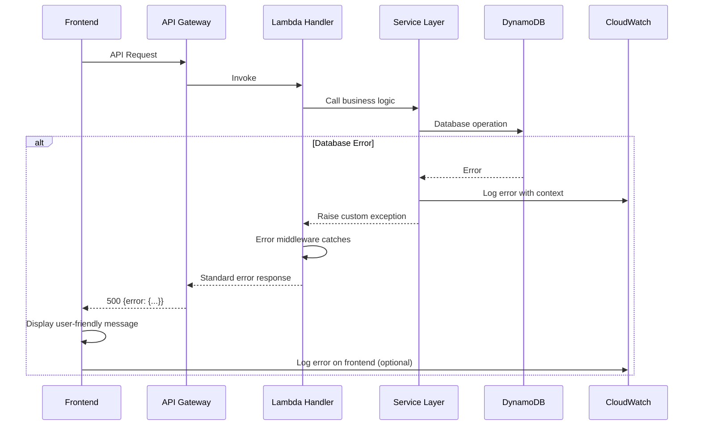

# Zapier Triggers API - Full-Stack Architecture Document

**Project ID:** K1oUUDeoZrvJkVZafqHL_1761943818847  
**Organization:** Zapier  
**Version:** 1.0  
**Last Updated:** 2025-11-11

---

## Introduction

This document outlines the complete full-stack architecture for the Zapier Triggers API, including backend systems, minimal frontend implementation, and their integration. It serves as the single source of truth for AI-driven development, ensuring consistency across the entire technology stack.

This unified approach combines backend API architecture with developer-facing UI components, streamlining the development process for this modern serverless application where API and developer experience are paramount.

### Starter Template or Existing Project

**N/A - Greenfield Project**

This is a greenfield serverless API project. We will leverage AWS Serverless Application Model (AWS SAM) and AWS CloudFormation templates as foundational infrastructure-as-code patterns, but no specific application starter template is required. The architecture will be built from scratch following AWS serverless best practices.

### Change Log

| Date | Version | Description | Author |
|------|---------|-------------|---------|
| 2025-11-11 | 1.0 | Initial architecture document | Architect Agent |

---

## 1. High Level Architecture

### 1.1 Technical Summary

The Zapier Triggers API is a serverless, event-driven REST API built on AWS Lambda and API Gateway, designed for high availability and horizontal scalability. The backend leverages Python 3.11 with FastAPI for API route handling, DynamoDB for event storage, and SQS for reliable event queuing. The system integrates with Zapier's existing workflow execution engine through internal APIs while exposing a public REST interface for external developers. A minimal React-based developer dashboard (integrated into Zapier's existing developer console) provides API key management and event monitoring. The architecture achieves <100ms p95 latency and 99.9% uptime requirements through AWS managed services, auto-scaling policies, and multi-AZ deployment, enabling real-time, push-based event ingestion that transforms Zapier from a polling model to an event-driven automation platform.

### 1.2 Platform and Infrastructure Choice

**Platform:** AWS (Amazon Web Services)

**Key Services:**
- **Compute:** AWS Lambda (serverless functions)
- **API Management:** Amazon API Gateway (REST API, custom authorizers)
- **Database:** Amazon DynamoDB (event storage with TTL and Streams)
- **Queue:** Amazon SQS (event buffering, dead-letter queues)
- **Storage:** Amazon S3 (event archival, cold storage for compliance)
- **Security:** AWS Secrets Manager (API keys), Systems Manager Parameter Store (configuration)
- **Monitoring:** Amazon CloudWatch (logs, metrics, alarms, dashboards), AWS X-Ray (distributed tracing)
- **Networking:** AWS VPC (private networking for internal integrations)
- **CI/CD:** AWS CodePipeline (optional) or GitHub Actions

**Deployment Host and Regions:**
- Primary Region: `us-east-1` (N. Virginia) for Phase 1
- Multi-region expansion planned for Phase 2
- All services deployed within VPC with multi-AZ configuration for high availability

**Rationale:**
AWS was selected because:
1. **Serverless Ecosystem Maturity:** Best-in-class Lambda, API Gateway, and DynamoDB integration
2. **Scalability:** Auto-scaling to 10,000+ events/sec without manual intervention
3. **Cost Efficiency:** Pay-per-use pricing aligns with variable event ingestion patterns
4. **Enterprise Integration:** Existing Zapier infrastructure likely on AWS, simplifying internal integrations
5. **Compliance:** AWS provides SOC 2, GDPR, and CCPA compliance certifications required for customer data

### 1.3 Repository Structure

**Structure:** Monorepo

**Monorepo Tool:** Not required - Simple monorepo with npm/poetry workspaces

**Package Organization:**
- `services/api/` - Backend Lambda functions and API logic (Python)
- `services/worker/` - Background workers for event processing (Python)
- `apps/developer-dashboard/` - React-based developer UI (TypeScript/React)
- `packages/shared-types/` - Shared TypeScript interfaces for API contracts
- `infrastructure/` - Terraform/CloudFormation for IaC
- `scripts/` - Deployment and utility scripts
- `docs/` - Documentation including this architecture doc

**Rationale:**
A lightweight monorepo without complex tooling (Nx, Turborepo) is sufficient for this project. The backend is primarily Python with limited TypeScript for the dashboard, so simple workspace management via npm (frontend) and poetry (backend) keeps tooling minimal while allowing shared type definitions between frontend and backend.

### 1.4 High Level Architecture Diagram



### 1.5 Architectural Patterns

- **Serverless Architecture:** Lambda functions for compute, eliminating server management - _Rationale:_ Auto-scaling to handle variable event loads (0 to 10,000+ events/sec) with pay-per-use pricing, reducing operational overhead and aligning costs with usage

- **Event-Driven Architecture:** DynamoDB Streams and SQS for asynchronous event processing - _Rationale:_ Decouples event ingestion from delivery, enabling resilient processing with automatic retries and dead-letter handling for failed events

- **API Gateway Pattern:** Centralized API management with custom authorizers - _Rationale:_ Provides single entry point for authentication, rate limiting, request validation, and CORS management, simplifying security and monitoring

- **Repository Pattern:** Abstract data access through service layer - _Rationale:_ Isolates DynamoDB implementation details, enabling easier testing with mocks and potential future database migrations without changing business logic

- **Circuit Breaker Pattern:** Automatic retry with exponential backoff for external integrations - _Rationale:_ Prevents cascading failures when internal Zapier services are temporarily unavailable, improving system resilience

- **CQRS Light:** Separate read (inbox queries) and write (event ingestion) paths - _Rationale:_ Optimizes DynamoDB indexes for different access patterns, improving performance for both high-volume writes and efficient queries

- **Immutable Infrastructure:** Infrastructure as Code with Terraform/CloudFormation - _Rationale:_ Enables reproducible deployments across environments, versioned infrastructure changes, and rapid rollback capabilities

---

## 2. Tech Stack

### 2.1 Technology Stack Table

| Category | Technology | Version | Purpose | Rationale |
|----------|-----------|---------|---------|-----------|
| Backend Language | Python | 3.11 | API and worker logic | Fast development, rich AWS SDK (boto3), excellent for serverless, strong typing with type hints |
| Backend Framework | FastAPI | 0.104+ | REST API framework | High performance async framework, automatic OpenAPI docs, Pydantic validation, native async/await support |
| API Style | REST | OpenAPI 3.0 | External developer API | Industry standard for public APIs, well-understood by developers, extensive tooling ecosystem |
| Database | Amazon DynamoDB | N/A | Event storage | Serverless, auto-scaling, <10ms latency, TTL for auto-expiration, Streams for change data capture |
| Queue | Amazon SQS | N/A | Event buffering | Managed message queue, unlimited scaling, at-least-once delivery, dead-letter queue support |
| File Storage | Amazon S3 | N/A | Event archival | Durable cold storage for compliance, lifecycle policies, low-cost long-term retention |
| Cache | DynamoDB DAX | Optional | Query acceleration | Optional in-memory cache for hot read paths, sub-millisecond latency if needed for /inbox queries |
| Authentication | API Keys + JWT | N/A | Developer auth | Simple API key auth for ingestion, JWT tokens for dashboard, stored in AWS Secrets Manager |
| Validation | Pydantic | 2.4+ | Request/response validation | Automatic validation, type safety, generates JSON schemas, integrates with FastAPI |
| IaC Tool | Terraform | 1.5+ | Infrastructure provisioning | Multi-cloud support (future-proof), strong AWS provider, state management, mature ecosystem |
| CI/CD | GitHub Actions | N/A | Build and deploy pipeline | Free for public repos, native Git integration, extensive AWS actions marketplace |
| Backend Testing | Pytest | 7.4+ | Unit and integration tests | Python standard, fixtures, mocking support (pytest-mock), async test support |
| API Testing | Moto | 4.2+ | AWS service mocking | Mock boto3 calls in tests, LocalStack alternative for unit tests |
| E2E Testing | Locust | 2.16+ | Load and performance testing | Python-based load testing, distributed execution, validates 10,000 events/sec requirement |
| Monitoring | CloudWatch | N/A | Logs, metrics, alarms | Native AWS integration, structured logging, custom metrics, dashboards |
| Tracing | AWS X-Ray | N/A | Distributed tracing | Traces Lambda invocations, API Gateway requests, identifies performance bottlenecks |
| Logging | structlog | 23.1+ | Structured JSON logging | Context-aware logging, correlation IDs, JSON output for CloudWatch Insights queries |
| Frontend Language | TypeScript | 5.2+ | Developer dashboard | Type safety, better IDE support, reduces runtime errors |
| Frontend Framework | React | 18.2+ | UI components | Component-based, large ecosystem, integrates with Zapier's existing dev console |
| UI Component Library | shadcn/ui | Latest | Pre-built components | Accessible, customizable, Tailwind-based, modern design |
| State Management | TanStack Query | 5.0+ | Server state management | Automatic caching, refetching, optimistic updates for API calls |
| CSS Framework | Tailwind CSS | 3.3+ | Styling | Utility-first, fast development, small bundle size with PurgeCSS |
| Build Tool (Frontend) | Vite | 4.5+ | Dev server and bundler | Fast HMR, optimized builds, native ESM support |
| Build Tool (Backend) | Poetry | 1.6+ | Python dependency management | Lock file for reproducible builds, virtual environment management |
| Frontend Testing | Vitest + Testing Library | Latest | Component unit tests | Fast, Vite-native, React Testing Library for user-centric tests |
| Linting/Formatting (Backend) | Black + Flake8 + mypy | Latest | Code quality | Consistent formatting (Black), style checking (Flake8), type checking (mypy) |
| Linting/Formatting (Frontend) | ESLint + Prettier | Latest | Code quality | Consistent code style, catches common mistakes |

---

## 3. Data Models

### 3.1 Event Model

**Purpose:** Core entity representing an event sent by external systems to trigger Zapier workflows

**Key Attributes:**
- `event_id` (string, UUID): Unique identifier for the event
- `user_id` (string): Zapier developer/integration ID that owns this event
- `event_type` (string): Type/category of event (e.g., "user.created", "order.completed")
- `payload` (object): The actual event data as JSON
- `status` (enum): Event lifecycle status - "received", "queued", "delivered", "failed"
- `timestamp` (datetime, ISO 8601): When event was received
- `ttl` (number): Unix timestamp for DynamoDB TTL (30 days from receipt)
- `retry_count` (number): Number of delivery attempts
- `last_retry_at` (datetime): Timestamp of last retry attempt
- `delivered_at` (datetime, nullable): When event was successfully delivered
- `metadata` (object): Additional metadata (source IP, API version, correlation ID)

#### TypeScript Interface

```typescript
interface Event {
  event_id: string;
  user_id: string;
  event_type: string;
  payload: Record<string, any>;
  status: 'received' | 'queued' | 'delivered' | 'failed';
  timestamp: string; // ISO 8601
  ttl: number;
  retry_count: number;
  last_retry_at?: string;
  delivered_at?: string;
  metadata: {
    source_ip?: string;
    api_version: string;
    correlation_id: string;
    user_agent?: string;
  };
}
```

#### Relationships

- One User has many Events (1:N)
- Events are independent entities with no parent-child relationships
- Events may reference external entities in payload but maintain no foreign key constraints

### 3.2 API Key Model

**Purpose:** Authentication credentials for external developers to access the Triggers API

**Key Attributes:**
- `key_id` (string, UUID): Unique identifier for the API key
- `user_id` (string): Zapier developer/integration ID that owns this key
- `key_hash` (string): Hashed API key value (never store plain text)
- `name` (string): Human-readable name/description
- `created_at` (datetime): Creation timestamp
- `last_used_at` (datetime, nullable): Last usage timestamp
- `expires_at` (datetime, nullable): Optional expiration date
- `rate_limit` (number): Requests per minute limit (default: 1000)
- `is_active` (boolean): Whether key is currently active
- `scopes` (array): Permissions granted to this key (e.g., ["events:write", "events:read"])

#### TypeScript Interface

```typescript
interface APIKey {
  key_id: string;
  user_id: string;
  key_hash: string;
  name: string;
  created_at: string;
  last_used_at?: string;
  expires_at?: string;
  rate_limit: number;
  is_active: boolean;
  scopes: string[];
}
```

#### Relationships

- One User has many API Keys (1:N)
- API Keys are used to authenticate Event ingestion requests

### 3.3 Audit Log Model

**Purpose:** Immutable record of all events and actions for compliance and debugging

**Key Attributes:**
- `log_id` (string, UUID): Unique log entry identifier
- `event_id` (string, nullable): Related event ID if applicable
- `user_id` (string): User who performed the action
- `action` (enum): Action type - "event.created", "event.delivered", "event.deleted", "key.created", etc.
- `timestamp` (datetime): When action occurred
- `details` (object): Action-specific details
- `ip_address` (string): Source IP address
- `request_id` (string): Correlation ID for tracing

#### TypeScript Interface

```typescript
interface AuditLog {
  log_id: string;
  event_id?: string;
  user_id: string;
  action: string;
  timestamp: string;
  details: Record<string, any>;
  ip_address: string;
  request_id: string;
}
```

#### Relationships

- Audit Logs reference Events and Users but are append-only (no updates/deletes)
- 7-year retention for compliance requirements

---

## 4. API Specification

### 4.1 REST API Specification

```yaml
openapi: 3.0.0
info:
  title: Zapier Triggers API
  version: 1.0.0
  description: |
    Public REST API for ingesting events into Zapier workflows. Enables external systems
    to send events in real-time, triggering Zapier automations instantly.
  contact:
    email: triggers-api@zapier.com
servers:
  - url: https://triggers-api.zapier.com/v1
    description: Production API
  - url: https://triggers-api-staging.zapier.com/v1
    description: Staging environment

security:
  - ApiKeyAuth: []

paths:
  /events:
    post:
      summary: Ingest a new event
      description: Submit an event to the Triggers API for processing by Zapier workflows
      operationId: createEvent
      tags:
        - Events
      requestBody:
        required: true
        content:
          application/json:
            schema:
              $ref: '#/components/schemas/EventInput'
            examples:
              userCreated:
                summary: User created event
                value:
                  event_type: "user.created"
                  payload:
                    user_id: "usr_12345"
                    email: "newuser@example.com"
                    name: "Jane Doe"
                    created_at: "2025-11-11T10:00:00Z"
      responses:
        '201':
          description: Event successfully created
          content:
            application/json:
              schema:
                $ref: '#/components/schemas/EventResponse'
        '400':
          description: Invalid request payload
          content:
            application/json:
              schema:
                $ref: '#/components/schemas/Error'
        '401':
          description: Unauthorized - invalid or missing API key
          content:
            application/json:
              schema:
                $ref: '#/components/schemas/Error'
        '429':
          description: Rate limit exceeded
          content:
            application/json:
              schema:
                $ref: '#/components/schemas/Error'
        '500':
          description: Internal server error
          content:
            application/json:
              schema:
                $ref: '#/components/schemas/Error'

  /events/batch:
    post:
      summary: Ingest multiple events
      description: Submit up to 100 events in a single batch request
      operationId: createBatchEvents
      tags:
        - Events
      requestBody:
        required: true
        content:
          application/json:
            schema:
              type: object
              properties:
                events:
                  type: array
                  items:
                    $ref: '#/components/schemas/EventInput'
                  maxItems: 100
              required:
                - events
      responses:
        '201':
          description: Batch processed
          content:
            application/json:
              schema:
                type: object
                properties:
                  success_count:
                    type: integer
                  failure_count:
                    type: integer
                  results:
                    type: array
                    items:
                      $ref: '#/components/schemas/EventResponse'

  /inbox:
    get:
      summary: Retrieve undelivered events
      description: Query events awaiting delivery to Zapier workflows
      operationId: listInboxEvents
      tags:
        - Inbox
      parameters:
        - name: event_type
          in: query
          schema:
            type: string
          description: Filter by event type
        - name: status
          in: query
          schema:
            type: string
            enum: [received, queued, failed]
          description: Filter by status
        - name: limit
          in: query
          schema:
            type: integer
            default: 50
            maximum: 200
          description: Number of events to return
        - name: offset
          in: query
          schema:
            type: string
          description: Pagination cursor from previous response
        - name: from_timestamp
          in: query
          schema:
            type: string
            format: date-time
          description: Filter events after this timestamp
        - name: to_timestamp
          in: query
          schema:
            type: string
            format: date-time
          description: Filter events before this timestamp
      responses:
        '200':
          description: List of events
          content:
            application/json:
              schema:
                type: object
                properties:
                  events:
                    type: array
                    items:
                      $ref: '#/components/schemas/Event'
                  pagination:
                    type: object
                    properties:
                      limit:
                        type: integer
                      offset:
                        type: string
                      has_more:
                        type: boolean

  /events/{event_id}:
    get:
      summary: Get event details
      description: Retrieve full details of a specific event
      operationId: getEvent
      tags:
        - Events
      parameters:
        - name: event_id
          in: path
          required: true
          schema:
            type: string
            format: uuid
      responses:
        '200':
          description: Event details
          content:
            application/json:
              schema:
                $ref: '#/components/schemas/Event'
        '404':
          description: Event not found
          content:
            application/json:
              schema:
                $ref: '#/components/schemas/Error'

    delete:
      summary: Acknowledge event delivery
      description: Mark an event as delivered and remove from inbox
      operationId: acknowledgeEvent
      tags:
        - Events
      parameters:
        - name: event_id
          in: path
          required: true
          schema:
            type: string
            format: uuid
      responses:
        '204':
          description: Event acknowledged and deleted
        '404':
          description: Event not found
          content:
            application/json:
              schema:
                $ref: '#/components/schemas/Error'
        '410':
          description: Event already deleted
          content:
            application/json:
              schema:
                $ref: '#/components/schemas/Error'

  /events/{event_id}/status:
    get:
      summary: Get event status
      description: Retrieve current status and delivery history of an event
      operationId: getEventStatus
      tags:
        - Events
      parameters:
        - name: event_id
          in: path
          required: true
          schema:
            type: string
            format: uuid
      responses:
        '200':
          description: Event status
          content:
            application/json:
              schema:
                type: object
                properties:
                  event_id:
                    type: string
                  status:
                    type: string
                    enum: [received, queued, delivered, failed]
                  retry_count:
                    type: integer
                  last_retry_at:
                    type: string
                    format: date-time
                  delivered_at:
                    type: string
                    format: date-time

  /health:
    get:
      summary: Health check
      description: Check API health status
      operationId: healthCheck
      tags:
        - System
      security: []
      responses:
        '200':
          description: API is healthy
          content:
            application/json:
              schema:
                type: object
                properties:
                  status:
                    type: string
                    example: "healthy"
                  timestamp:
                    type: string
                    format: date-time
                  version:
                    type: string
                    example: "1.0.0"

components:
  securitySchemes:
    ApiKeyAuth:
      type: apiKey
      in: header
      name: X-API-Key

  schemas:
    EventInput:
      type: object
      required:
        - event_type
        - payload
      properties:
        event_type:
          type: string
          description: Type/category of the event
          example: "user.created"
        payload:
          type: object
          description: Event data as JSON object
          additionalProperties: true

    EventResponse:
      type: object
      properties:
        event_id:
          type: string
          format: uuid
          description: Unique event identifier
        status:
          type: string
          enum: [received, queued]
          description: Current event status
        timestamp:
          type: string
          format: date-time
          description: When event was received
        message:
          type: string
          description: Confirmation message

    Event:
      type: object
      properties:
        event_id:
          type: string
          format: uuid
        user_id:
          type: string
        event_type:
          type: string
        payload:
          type: object
          additionalProperties: true
        status:
          type: string
          enum: [received, queued, delivered, failed]
        timestamp:
          type: string
          format: date-time
        retry_count:
          type: integer
        last_retry_at:
          type: string
          format: date-time
        delivered_at:
          type: string
          format: date-time
        metadata:
          type: object
          properties:
            source_ip:
              type: string
            api_version:
              type: string
            correlation_id:
              type: string
            user_agent:
              type: string

    Error:
      type: object
      properties:
        error:
          type: object
          properties:
            code:
              type: string
              description: Machine-readable error code
            message:
              type: string
              description: Human-readable error message
            details:
              type: object
              description: Additional error context
              additionalProperties: true
            timestamp:
              type: string
              format: date-time
            request_id:
              type: string
              description: Request correlation ID for support
```

---

## 5. Components

### 5.1 Event Ingestion Service

**Responsibility:** Accept and validate incoming events from external developers, persist to DynamoDB, and enqueue for processing

**Key Interfaces:**
- `POST /events` - Single event ingestion
- `POST /events/batch` - Batch event ingestion (up to 100 events)
- Internal: `EventValidator` - Validates payload against schemas
- Internal: `EventPersistence` - DynamoDB write operations

**Dependencies:**
- DynamoDB Events table (write)
- SQS Event queue (send message)
- Secrets Manager (API key validation via Custom Authorizer)
- CloudWatch (logging)

**Technology Stack:**
- AWS Lambda (Python 3.11, FastAPI via Mangum adapter)
- Pydantic for request validation
- boto3 for AWS SDK calls
- Deployed via API Gateway Lambda integration

### 5.2 Custom Authorizer Service

**Responsibility:** Authenticate API requests by validating API keys and enforcing rate limits

**Key Interfaces:**
- API Gateway custom authorizer endpoint
- Internal: `APIKeyValidator` - Validates and retrieves key details
- Internal: `RateLimiter` - Checks request rate against limits

**Dependencies:**
- Secrets Manager (API key storage)
- DynamoDB API Keys table (metadata and rate limits)
- CloudWatch (logging unauthorized attempts)

**Technology Stack:**
- AWS Lambda (Python 3.11)
- API Gateway custom authorizer framework
- JWT generation for authorized requests (caching auth decisions)

### 5.3 Event Inbox Service

**Responsibility:** Query and retrieve undelivered events for Zapier workflows

**Key Interfaces:**
- `GET /inbox` - List undelivered events with filtering and pagination
- `GET /events/{event_id}` - Retrieve specific event details
- Internal: `InboxQuery` - Optimized DynamoDB queries using GSI

**Dependencies:**
- DynamoDB Events table (read with indexes)
- CloudWatch (logging and metrics)

**Technology Stack:**
- AWS Lambda (Python 3.11, FastAPI)
- DynamoDB query optimization with Global Secondary Indexes
- Cursor-based pagination for efficient large result sets

### 5.4 Event Acknowledgment Service

**Responsibility:** Mark events as delivered and remove from inbox, maintaining audit trail

**Key Interfaces:**
- `DELETE /events/{event_id}` - Acknowledge single event
- `POST /events/acknowledge/batch` - Bulk acknowledgment
- Internal: `AuditLogger` - Creates audit log entries

**Dependencies:**
- DynamoDB Events table (update status, then delete)
- DynamoDB Audit Logs table (write)
- CloudWatch (logging)

**Technology Stack:**
- AWS Lambda (Python 3.11)
- DynamoDB conditional updates (idempotency)
- Transaction support for atomic audit log + delete

### 5.5 Event Processor Worker

**Responsibility:** Process events from SQS queue, handle retries, and deliver to Zapier workflow engine

**Key Interfaces:**
- SQS message consumer (triggered by queue)
- Internal: `WorkflowNotifier` - Calls internal Zapier workflow API
- Internal: `RetryManager` - Implements exponential backoff
- Internal: `DeadLetterHandler` - Processes permanently failed events

**Dependencies:**
- SQS Event queue (receive and delete messages)
- DynamoDB Events table (update status and retry count)
- Zapier internal workflow API (HTTP calls)
- SQS Dead Letter Queue (failed events)
- CloudWatch (metrics on success/failure rates)

**Technology Stack:**
- AWS Lambda (Python 3.11)
- SQS batch processing (up to 10 messages per invocation)
- Exponential backoff: 5min, 30min, 2hr (max 3 retries over 24hr)

### 5.6 Developer Dashboard

**Responsibility:** Provide web UI for API key management, event monitoring, and metrics visualization

**Key Interfaces:**
- React SPA integrated into Zapier's developer console
- Consumes all Triggers API endpoints via REST calls
- Internal: `DashboardAPI` - TypeScript API client layer

**Dependencies:**
- API Gateway (calls all REST endpoints)
- CloudFront (static asset hosting)
- Zapier authentication system (SSO integration)

**Technology Stack:**
- React 18.2 with TypeScript
- TanStack Query for server state management
- shadcn/ui + Tailwind CSS for UI components
- Vite for build and dev server
- Recharts for metrics visualization

### 5.7 Component Diagrams



---

## 6. External APIs

### 6.1 Zapier Workflow Engine API (Internal)

- **Purpose:** Deliver events to Zapier's internal workflow execution system for triggering automations
- **Documentation:** Internal Zapier documentation (not public)
- **Base URL(s):** `https://internal-workflow-api.zapier.com` (example, actual URL TBD)
- **Authentication:** Service-to-service authentication using AWS IAM roles or internal JWT tokens
- **Rate Limits:** TBD based on internal infrastructure capacity (assume generous limits for internal service)

**Key Endpoints Used:**
- `POST /v1/triggers/event` - Submit event to workflow engine for processing

**Integration Notes:**
- This is a **critical integration** requiring coordination with Zapier's platform team
- Must handle backpressure if workflow engine is temporarily unavailable
- Implement circuit breaker pattern with exponential backoff
- DynamoDB Streams can be an alternative integration mechanism - evaluate with team

**No other external APIs required for MVP.** All functionality is self-contained within AWS services and Zapier's internal infrastructure.

---

## 7. Core Workflows

### 7.1 Event Ingestion and Delivery Workflow



### 7.2 Event Inbox Query Workflow



### 7.3 Error Handling Workflow



---

## 8. Database Schema

### 8.1 DynamoDB Events Table

**Table Name:** `zapier-triggers-api-events-{env}`

**Primary Key:**
- **Partition Key:** `user_id` (String) - Zapier developer/integration ID
- **Sort Key:** `timestamp#event_id` (String) - Composite of ISO timestamp + event_id for chronological ordering

**Attributes:**
- `user_id` (S) - PK
- `timestamp#event_id` (S) - SK (composite: "2025-11-11T10:00:00Z#uuid")
- `event_id` (S) - UUID
- `event_type` (S) - Event category
- `payload` (M) - JSON event data (Map type)
- `status` (S) - Enum: received | queued | delivered | failed
- `retry_count` (N) - Number of retry attempts
- `last_retry_at` (S) - ISO 8601 timestamp
- `delivered_at` (S) - ISO 8601 timestamp (sparse)
- `ttl` (N) - Unix timestamp for auto-deletion (30 days)
- `metadata` (M) - Additional context (source_ip, api_version, correlation_id)

**Global Secondary Index (GSI):**

**GSI-1: EventTypeIndex**
- **Partition Key:** `user_id` (S)
- **Sort Key:** `event_type#timestamp` (S)
- **Purpose:** Query events by type for filtering in /inbox endpoint
- **Projection:** ALL

**GSI-2: StatusIndex**
- **Partition Key:** `user_id` (S)
- **Sort Key:** `status#timestamp` (S)
- **Purpose:** Efficiently query undelivered events (status=received or queued)
- **Projection:** ALL

**TTL Configuration:**
- **TTL Attribute:** `ttl`
- **Enabled:** Yes
- **Behavior:** DynamoDB automatically deletes items where ttl < current Unix time
- **Archive Strategy:** DynamoDB Streams trigger Lambda to copy expired items to S3 before deletion

**Capacity Settings:**
- **Billing Mode:** On-Demand (auto-scaling)
- **Alternative:** Provisioned with Auto Scaling (5-100 WCU/RCU) if cost optimization needed
- **Point-in-Time Recovery:** Enabled for disaster recovery

### 8.2 DynamoDB API Keys Table

**Table Name:** `zapier-triggers-api-keys-{env}`

**Primary Key:**
- **Partition Key:** `user_id` (String)
- **Sort Key:** `key_id` (String) - UUID

**Attributes:**
- `user_id` (S) - PK
- `key_id` (S) - SK (UUID)
- `key_hash` (S) - SHA-256 hash of API key (never store plaintext)
- `name` (S) - Human-readable key name
- `created_at` (S) - ISO 8601 timestamp
- `last_used_at` (S) - ISO 8601 timestamp (updated on each use)
- `expires_at` (S) - ISO 8601 timestamp (nullable)
- `rate_limit` (N) - Requests per minute (default: 1000)
- `is_active` (B) - Boolean flag
- `scopes` (L) - List of permission strings

**Global Secondary Index (GSI):**

**GSI-1: KeyHashIndex**
- **Partition Key:** `key_hash` (S)
- **Purpose:** Lookup API key by hash during authentication
- **Projection:** ALL
- **Note:** This GSI must be queried during auth to validate API keys

**Capacity Settings:**
- **Billing Mode:** On-Demand
- **Expected Access Pattern:** High read (every API call), low write (key creation/rotation)

### 8.3 DynamoDB Audit Logs Table

**Table Name:** `zapier-triggers-api-audit-logs-{env}`

**Primary Key:**
- **Partition Key:** `user_id` (String)
- **Sort Key:** `timestamp#log_id` (String) - Composite for chronological ordering

**Attributes:**
- `user_id` (S) - PK
- `timestamp#log_id` (S) - SK
- `log_id` (S) - UUID
- `event_id` (S) - Related event ID (nullable)
- `action` (S) - Action type (event.created, event.delivered, key.created, etc.)
- `timestamp` (S) - ISO 8601
- `details` (M) - Action-specific details as JSON
- `ip_address` (S) - Source IP
- `request_id` (S) - Correlation ID

**TTL Configuration:**
- **TTL Attribute:** `ttl`
- **Enabled:** Yes
- **Retention:** 7 years (2557 days) for compliance (GDPR, SOX)

**Capacity Settings:**
- **Billing Mode:** On-Demand
- **Access Pattern:** Write-heavy (append-only), infrequent reads (audit queries)
- **Backup:** Daily snapshots exported to S3 for long-term compliance storage

### 8.4 Database Schema Diagram

```mermaid
erDiagram
    EVENTS {
        string user_id PK
        string timestamp_event_id SK
        string event_id
        string event_type
        map payload
        string status
        number retry_count
        string last_retry_at
        string delivered_at
        number ttl
        map metadata
    }
    
    API_KEYS {
        string user_id PK
        string key_id SK
        string key_hash
        string name
        string created_at
        string last_used_at
        string expires_at
        number rate_limit
        boolean is_active
        list scopes
    }
    
    AUDIT_LOGS {
        string user_id PK
        string timestamp_log_id SK
        string log_id
        string event_id
        string action
        string timestamp
        map details
        string ip_address
        string request_id
        number ttl
    }
    
    USER ||--o{ EVENTS : "owns"
    USER ||--o{ API_KEYS : "has"
    USER ||--o{ AUDIT_LOGS : "generates"
    EVENTS ||--o{ AUDIT_LOGS : "references"
```

---

## 9. Frontend Architecture

### 9.1 Component Architecture

The Developer Dashboard is a minimal React SPA integrated into Zapier's existing developer console. It follows a component-based architecture with clear separation of concerns.

#### Component Organization

```
apps/developer-dashboard/src/
├── components/
│   ├── ApiKeyCard.tsx          # Display single API key
│   ├── ApiKeyList.tsx           # List all keys
│   ├── ApiKeyCreateForm.tsx     # Create new key
│   ├── EventMonitor.tsx         # Real-time event display
│   ├── EventList.tsx            # Table of events
│   ├── EventFilters.tsx         # Filter controls
│   ├── MetricsDashboard.tsx     # Metrics visualization
│   └── ui/                      # shadcn/ui components
│       ├── Button.tsx
│       ├── Card.tsx
│       ├── Table.tsx
│       └── ...
├── pages/
│   ├── Dashboard.tsx            # Main overview page
│   ├── ApiKeys.tsx              # API key management
│   └── Events.tsx               # Event monitoring
├── hooks/
│   ├── useApiKeys.ts            # TanStack Query hooks for keys
│   ├── useEvents.ts             # TanStack Query hooks for events
│   └── useAuth.ts               # Zapier SSO integration
├── services/
│   └── api-client.ts            # Axios-based API client
├── types/
│   └── api.ts                   # TypeScript interfaces (imported from shared)
└── App.tsx                      # Root component with routing
```

#### Component Template Example

```typescript
import { useApiKeys } from '@/hooks/useApiKeys';
import { Card, CardContent, CardHeader, CardTitle } from '@/components/ui/Card';
import { Button } from '@/components/ui/Button';

export const ApiKeyList: React.FC = () => {
  const { data: apiKeys, isLoading, error, mutate } = useApiKeys();

  const handleRevoke = async (keyId: string) => {
    await mutate.revokeKey(keyId);
  };

  if (isLoading) return <div>Loading...</div>;
  if (error) return <div>Error: {error.message}</div>;

  return (
    <Card>
      <CardHeader>
        <CardTitle>API Keys</CardTitle>
      </CardHeader>
      <CardContent>
        {apiKeys.map((key) => (
          <ApiKeyCard 
            key={key.key_id} 
            apiKey={key}
            onRevoke={handleRevoke}
          />
        ))}
      </CardContent>
    </Card>
  );
};
```

### 9.2 State Management Architecture

We use **TanStack Query** (React Query) for server state management, eliminating the need for Redux/Zustand for this API-heavy application.

#### State Structure

```typescript
// All API state managed by TanStack Query
// Query Keys structure:
const queryKeys = {
  apiKeys: ['apiKeys'] as const,
  apiKey: (id: string) => ['apiKeys', id] as const,
  events: (filters?: EventFilters) => ['events', filters] as const,
  event: (id: string) => ['events', id] as const,
  metrics: ['metrics'] as const,
};

// Local UI state managed by React useState/useReducer
// Examples:
// - Filter selections
// - Modal open/close
// - Form validation errors
```

#### State Management Patterns

- **Server State:** All API data managed by TanStack Query (automatic caching, refetching, optimistic updates)
- **Local UI State:** React useState for simple UI state (modals, dropdowns)
- **Form State:** React Hook Form for complex forms with validation
- **No Global State Library:** Avoid Redux/Zustand - server state dominates this app

### 9.3 Routing Architecture

Using React Router for client-side routing integrated into Zapier's developer console.

#### Route Organization

```
/developer/triggers-api/          # Dashboard overview
/developer/triggers-api/keys      # API key management
/developer/triggers-api/events    # Event monitoring
/developer/triggers-api/docs      # API documentation (links to OpenAPI)
```

#### Protected Route Pattern

```typescript
import { Navigate, Outlet } from 'react-router-dom';
import { useAuth } from '@/hooks/useAuth';

export const ProtectedRoute: React.FC = () => {
  const { isAuthenticated, isLoading } = useAuth();

  if (isLoading) {
    return <div>Loading...</div>;
  }

  if (!isAuthenticated) {
    return <Navigate to="/login" replace />;
  }

  return <Outlet />;
};

// Usage in router:
<Route element={<ProtectedRoute />}>
  <Route path="/developer/triggers-api" element={<Dashboard />} />
  <Route path="/developer/triggers-api/keys" element={<ApiKeys />} />
  <Route path="/developer/triggers-api/events" element={<Events />} />
</Route>
```

### 9.4 Frontend Services Layer

#### API Client Setup

```typescript
import axios, { AxiosInstance } from 'axios';

const API_BASE_URL = import.meta.env.VITE_API_BASE_URL || 'https://triggers-api.zapier.com/v1';

class TriggersAPIClient {
  private client: AxiosInstance;

  constructor() {
    this.client = axios.create({
      baseURL: API_BASE_URL,
      headers: {
        'Content-Type': 'application/json',
      },
    });

    // Add request interceptor for auth
    this.client.interceptors.request.use((config) => {
      const token = localStorage.getItem('zapier_auth_token');
      if (token) {
        config.headers.Authorization = `Bearer ${token}`;
      }
      return config;
    });

    // Add response interceptor for error handling
    this.client.interceptors.response.use(
      (response) => response,
      (error) => {
        if (error.response?.status === 401) {
          // Redirect to login
          window.location.href = '/login';
        }
        return Promise.reject(error);
      }
    );
  }

  // Events API
  async getEvents(filters?: EventFilters): Promise<Event[]> {
    const { data } = await this.client.get('/inbox', { params: filters });
    return data.events;
  }

  async getEvent(eventId: string): Promise<Event> {
    const { data } = await this.client.get(`/events/${eventId}`);
    return data;
  }

  async deleteEvent(eventId: string): Promise<void> {
    await this.client.delete(`/events/${eventId}`);
  }

  // API Keys API
  async getApiKeys(): Promise<APIKey[]> {
    const { data} = await this.client.get('/keys');
    return data.keys;
  }

  async createApiKey(name: string): Promise<APIKey> {
    const { data } = await this.client.post('/keys', { name });
    return data;
  }

  async revokeApiKey(keyId: string): Promise<void> {
    await this.client.delete(`/keys/${keyId}`);
  }
}

export const apiClient = new TriggersAPIClient();
```

---

## 10. Backend Architecture

### 10.1 Serverless Function Organization

```
services/api/src/
├── handlers/
│   ├── events.py              # Event ingestion handler
│   ├── inbox.py               # Inbox query handler
│   ├── acknowledgment.py      # Event ack handler
│   ├── auth.py                # Custom authorizer
│   └── health.py              # Health check handler
├── services/
│   ├── event_service.py       # Business logic for events
│   ├── auth_service.py        # Auth validation logic
│   └── notification_service.py # Zapier workflow integration
├── repositories/
│   ├── event_repository.py    # DynamoDB events access
│   ├── api_key_repository.py  # DynamoDB API keys access
│   └── audit_repository.py    # DynamoDB audit logs access
├── models/
│   ├── event.py               # Event data model (Pydantic)
│   ├── api_key.py             # API Key model
│   └── audit_log.py           # Audit log model
├── middleware/
│   ├── error_handler.py       # Global error handling
│   ├── logger.py              # Structured logging setup
│   └── cors.py                # CORS configuration
├── utils/
│   ├── validators.py          # Custom Pydantic validators
│   ├── response.py            # Standard response builders
│   └── crypto.py              # Hashing, encryption utils
└── config.py                  # Configuration management
```

### 10.2 Lambda Function Template Example

```python
import json
from typing import Dict, Any
from aws_lambda_powertools import Logger, Tracer
from aws_lambda_powertools.event_handler import APIGatewayRestResolver
from aws_lambda_powertools.logging import correlation_paths
from pydantic import ValidationError

from services.event_service import EventService
from models.event import EventInput
from middleware.error_handler import handle_error
from utils.response import success_response, error_response

logger = Logger()
tracer = Tracer()
app = APIGatewayRestResolver()

event_service = EventService()

@app.post("/events")
@tracer.capture_method
def create_event() -> Dict[str, Any]:
    """
    Ingest a new event.
    """
    try:
        # Parse and validate request body
        event_data = EventInput(**json.loads(app.current_event.body))
        
        # Business logic
        event = event_service.create_event(
            user_id=app.current_event.request_context.authorizer.user_id,
            event_data=event_data
        )
        
        logger.info(f"Event created: {event.event_id}")
        
        return success_response(
            status_code=201,
            data={
                "event_id": event.event_id,
                "status": event.status,
                "timestamp": event.timestamp,
                "message": "Event successfully created"
            }
        )
    
    except ValidationError as e:
        logger.warning(f"Validation error: {e}")
        return error_response(
            status_code=400,
            error_code="VALIDATION_ERROR",
            message="Invalid request payload",
            details=e.errors()
        )
    
    except Exception as e:
        logger.exception("Unexpected error creating event")
        return handle_error(e)

@logger.inject_lambda_context(correlation_id_path=correlation_paths.API_GATEWAY_REST)
@tracer.capture_lambda_handler
def lambda_handler(event: Dict[str, Any], context: Any) -> Dict[str, Any]:
    return app.resolve(event, context)
```

### 10.3 Data Access Layer (Repository Pattern)

```python
from typing import List, Optional
from datetime import datetime, timedelta
import boto3
from boto3.dynamodb.conditions import Key, Attr

from models.event import Event
from config import settings

class EventRepository:
    def __init__(self):
        self.dynamodb = boto3.resource('dynamodb')
        self.table = self.dynamodb.Table(settings.EVENTS_TABLE_NAME)
    
    def create(self, event: Event) -> Event:
        """Create a new event in DynamoDB."""
        item = event.dict()
        item['timestamp#event_id'] = f"{event.timestamp}#{event.event_id}"
        item['ttl'] = int((datetime.utcnow() + timedelta(days=30)).timestamp())
        
        self.table.put_item(Item=item)
        return event
    
    def get_by_id(self, user_id: str, event_id: str) -> Optional[Event]:
        """Retrieve event by ID."""
        # Query using GSI or scan (inefficient, use sparingly)
        response = self.table.query(
            IndexName='EventIdIndex',
            KeyConditionExpression=Key('event_id').eq(event_id)
        )
        
        if response['Items']:
            return Event(**response['Items'][0])
        return None
    
    def list_by_user(
        self, 
        user_id: str, 
        status: Optional[str] = None,
        event_type: Optional[str] = None,
        limit: int = 50
    ) -> List[Event]:
        """List events for a user with optional filters."""
        if status:
            # Use StatusIndex GSI
            response = self.table.query(
                IndexName='StatusIndex',
                KeyConditionExpression=Key('user_id').eq(user_id) & 
                                     Key('status#timestamp').begins_with(status),
                Limit=limit
            )
        else:
            # Use primary key
            response = self.table.query(
                KeyConditionExpression=Key('user_id').eq(user_id),
                Limit=limit,
                ScanIndexForward=False  # Newest first
            )
        
        return [Event(**item) for item in response['Items']]
    
    def update_status(self, user_id: str, event_id: str, status: str) -> None:
        """Update event status."""
        self.table.update_item(
            Key={
                'user_id': user_id,
                'timestamp#event_id': self._get_timestamp_key(event_id)
            },
            UpdateExpression='SET #status = :status, delivered_at = :delivered_at',
            ExpressionAttributeNames={'#status': 'status'},
            ExpressionAttributeValues={
                ':status': status,
                ':delivered_at': datetime.utcnow().isoformat()
            }
        )
    
    def delete(self, user_id: str, event_id: str) -> None:
        """Delete an event."""
        self.table.delete_item(
            Key={
                'user_id': user_id,
                'timestamp#event_id': self._get_timestamp_key(event_id)
            }
        )
    
    def _get_timestamp_key(self, event_id: str) -> str:
        """Helper to construct composite sort key."""
        # In production, cache this or pass timestamp with event_id
        response = self.table.query(
            IndexName='EventIdIndex',
            KeyConditionExpression=Key('event_id').eq(event_id),
            ProjectionExpression='timestamp#event_id'
        )
        return response['Items'][0]['timestamp#event_id']
```

### 10.4 Authentication Middleware

```python
import json
import hashlib
from typing import Dict, Any
from aws_lambda_powertools import Logger

from repositories.api_key_repository import APIKeyRepository

logger = Logger()
api_key_repo = APIKeyRepository()

def lambda_handler(event: Dict[str, Any], context: Any) -> Dict[str, Any]:
    """
    API Gateway Custom Authorizer.
    Validates API key and returns IAM policy.
    """
    try:
        # Extract API key from header
        api_key = event['headers'].get('X-API-Key') or event['headers'].get('x-api-key')
        
        if not api_key:
            logger.warning("Missing API key in request")
            raise Exception('Unauthorized')
        
        # Hash the API key
        key_hash = hashlib.sha256(api_key.encode()).hexdigest()
        
        # Lookup in DynamoDB
        api_key_record = api_key_repo.get_by_hash(key_hash)
        
        if not api_key_record or not api_key_record.is_active:
            logger.warning(f"Invalid or inactive API key: {key_hash[:8]}...")
            raise Exception('Unauthorized')
        
        # Check rate limit (simplified - use Redis/DynamoDB for production)
        # TODO: Implement rate limiting check
        
        # Update last_used_at
        api_key_repo.update_last_used(api_key_record.key_id)
        
        # Generate IAM policy
        policy = generate_policy(
            principal_id=api_key_record.user_id,
            effect='Allow',
            resource=event['methodArn'],
            context={
                'user_id': api_key_record.user_id,
                'key_id': api_key_record.key_id,
                'scopes': ','.join(api_key_record.scopes)
            }
        )
        
        logger.info(f"Authorized user: {api_key_record.user_id}")
        return policy
    
    except Exception as e:
        logger.exception("Authorization failed")
        raise Exception('Unauthorized')

def generate_policy(principal_id: str, effect: str, resource: str, context: Dict[str, str]) -> Dict[str, Any]:
    """Generate IAM policy for API Gateway."""
    return {
        'principalId': principal_id,
        'policyDocument': {
            'Version': '2012-10-17',
            'Statement': [{
                'Action': 'execute-api:Invoke',
                'Effect': effect,
                'Resource': resource
            }]
        },
        'context': context
    }
```

---

## 11. Unified Project Structure

```
zapier-triggers-api/
├── .github/                          # CI/CD workflows
│   └── workflows/
│       ├── ci.yaml                   # Test and lint on PR
│       ├── deploy-staging.yaml        # Deploy to staging
│       └── deploy-production.yaml     # Deploy to production
│
├── apps/
│   └── developer-dashboard/          # Frontend React application
│       ├── src/
│       │   ├── components/           # UI components
│       │   ├── pages/                # Page components
│       │   ├── hooks/                # Custom React hooks
│       │   ├── services/             # API client services
│       │   ├── types/                # TypeScript interfaces
│       │   ├── styles/               # Global styles
│       │   ├── App.tsx               # Root component
│       │   └── main.tsx              # Entry point
│       ├── public/                   # Static assets
│       ├── tests/                    # Frontend tests
│       ├── index.html
│       ├── package.json
│       ├── tsconfig.json
│       ├── vite.config.ts
│       └── tailwind.config.js
│
├── services/
│   ├── api/                          # Backend Lambda functions
│   │   ├── src/
│   │   │   ├── handlers/             # Lambda entry points
│   │   │   │   ├── events.py
│   │   │   │   ├── inbox.py
│   │   │   │   ├── acknowledgment.py
│   │   │   │   ├── auth.py
│   │   │   │   └── health.py
│   │   │   ├── services/             # Business logic
│   │   │   │   ├── event_service.py
│   │   │   │   ├── auth_service.py
│   │   │   │   └── notification_service.py
│   │   │   ├── repositories/         # Data access layer
│   │   │   │   ├── event_repository.py
│   │   │   │   ├── api_key_repository.py
│   │   │   │   └── audit_repository.py
│   │   │   ├── models/               # Pydantic models
│   │   │   │   ├── event.py
│   │   │   │   ├── api_key.py
│   │   │   │   └── audit_log.py
│   │   │   ├── middleware/           # Middleware
│   │   │   │   ├── error_handler.py
│   │   │   │   ├── logger.py
│   │   │   │   └── cors.py
│   │   │   ├── utils/                # Utilities
│   │   │   │   ├── validators.py
│   │   │   │   ├── response.py
│   │   │   │   └── crypto.py
│   │   │   └── config.py             # Configuration
│   │   ├── tests/
│   │   │   ├── unit/                 # Unit tests
│   │   │   ├── integration/          # Integration tests
│   │   │   └── conftest.py           # Pytest fixtures
│   │   ├── pyproject.toml            # Poetry dependencies
│   │   ├── poetry.lock
│   │   └── requirements.txt          # Lambda layer requirements
│   │
│   └── worker/                       # Event processor worker
│       ├── src/
│       │   ├── handler.py            # SQS consumer
│       │   ├── retry_manager.py      # Retry logic
│       │   └── workflow_client.py    # Zapier workflow integration
│       ├── tests/
│       ├── pyproject.toml
│       └── poetry.lock
│
├── packages/
│   └── shared-types/                 # Shared TypeScript/Python types
│       ├── src/
│       │   ├── event.ts              # Event interface
│       │   ├── api-key.ts            # API Key interface
│       │   └── index.ts              # Exports
│       ├── package.json
│       └── tsconfig.json
│
├── infrastructure/                   # Infrastructure as Code
│   ├── terraform/
│   │   ├── modules/
│   │   │   ├── api-gateway/         # API Gateway module
│   │   │   ├── lambda/              # Lambda functions module
│   │   │   ├── dynamodb/            # DynamoDB tables module
│   │   │   ├── sqs/                 # SQS queues module
│   │   │   └── monitoring/          # CloudWatch module
│   │   ├── environments/
│   │   │   ├── dev/
│   │   │   │   ├── main.tf
│   │   │   │   ├── variables.tf
│   │   │   │   └── terraform.tfvars
│   │   │   ├── staging/
│   │   │   └── production/
│   │   ├── main.tf                  # Root module
│   │   ├── variables.tf
│   │   ├── outputs.tf
│   │   └── backend.tf               # S3 backend config
│   │
│   └── scripts/
│       ├── deploy.sh                # Deployment script
│       ├── rollback.sh              # Rollback script
│       └── seed-data.sh             # Seed test data
│
├── docs/                             # Documentation
│   ├── prd.md                        # Product requirements
│   ├── architecture.md               # This document
│   ├── api/                          # API documentation
│   │   └── openapi.yaml              # OpenAPI spec
│   └── runbooks/                     # Operational runbooks
│       ├── deployment.md
│       ├── monitoring.md
│       └── incident-response.md
│
├── scripts/                          # Utility scripts
│   ├── setup-dev.sh                  # Local dev setup
│   ├── run-tests.sh                  # Run all tests
│   └── generate-api-key.py           # Generate test API keys
│
├── .env.example                      # Environment variable template
├── .gitignore
├── .cursorignore
├── package.json                      # Root package.json (workspaces)
├── README.md                         # Project README
└── LICENSE

```

---

## 12. Development Workflow

### 12.1 Prerequisites

```bash
# Install required tools
brew install python@3.11  # macOS
brew install node@18
brew install terraform
brew install awscli

# Install Poetry (Python dependency management)
curl -sSL https://install.python-poetry.org | python3 -

# Configure AWS CLI
aws configure
```

### 12.2 Initial Setup

```bash
# Clone repository
git clone https://github.com/zapier/triggers-api.git
cd zapier-triggers-api

# Install root dependencies
npm install

# Install backend dependencies
cd services/api
poetry install
poetry shell  # Activate virtualenv
cd ../..

# Install frontend dependencies
cd apps/developer-dashboard
npm install
cd ../..

# Copy environment variables
cp .env.example .env
# Edit .env with your values

# Initialize Terraform
cd infrastructure/terraform/environments/dev
terraform init
cd ../../../..

# Create local DynamoDB tables (optional, for local development)
# Use LocalStack or DynamoDB Local
docker-compose up -d  # If using LocalStack
```

### 12.3 Development Commands

```bash
# Start all services (uses docker-compose or individual commands)
npm run dev

# Start frontend only
cd apps/developer-dashboard
npm run dev
# Access at http://localhost:5173

# Start backend only (local Lambda emulation)
cd services/api
poetry run python -m awslambdaric src.handlers.events.lambda_handler
# Or use SAM CLI:
sam local start-api

# Run tests
npm run test             # All tests
npm run test:frontend    # Frontend tests only
npm run test:backend     # Backend tests only

# Linting and formatting
npm run lint             # Lint all code
npm run lint:fix         # Auto-fix linting issues
npm run format           # Format all code (Prettier + Black)

# Type checking
npm run typecheck        # Frontend TypeScript
cd services/api && poetry run mypy src/  # Backend type checking
```

### 12.4 Environment Configuration

#### Frontend Environment Variables (.env.local)

```bash
# API Configuration
VITE_API_BASE_URL=https://triggers-api-dev.zapier.com/v1
VITE_ENV=development

# Auth Configuration
VITE_ZAPIER_AUTH_URL=https://zapier.com/auth
```

#### Backend Environment Variables (.env)

```bash
# AWS Configuration
AWS_REGION=us-east-1
AWS_PROFILE=zapier-dev  # For local development

# DynamoDB Tables
EVENTS_TABLE_NAME=zapier-triggers-api-events-dev
API_KEYS_TABLE_NAME=zapier-triggers-api-keys-dev
AUDIT_LOGS_TABLE_NAME=zapier-triggers-api-audit-logs-dev

# SQS Queues
EVENT_QUEUE_URL=https://sqs.us-east-1.amazonaws.com/123456789/zapier-triggers-events-dev

# Secrets
API_KEY_SECRET_NAME=zapier-triggers-api/api-keys-dev

# Zapier Internal API
ZAPIER_WORKFLOW_API_URL=https://internal-workflow-api.zapier.com
ZAPIER_WORKFLOW_API_TOKEN=<secret>

# Logging
LOG_LEVEL=DEBUG
POWERTOOLS_SERVICE_NAME=zapier-triggers-api
```

#### Shared Environment Variables

```bash
# Environment
ENVIRONMENT=dev  # dev | staging | production

# Feature Flags
ENABLE_RATE_LIMITING=true
ENABLE_METRICS=true
```

---

## 13. Deployment Architecture

### 13.1 Deployment Strategy

**Frontend Deployment:**
- **Platform:** AWS CloudFront + S3
- **Build Command:** `npm run build` (Vite production build)
- **Output Directory:** `apps/developer-dashboard/dist`
- **CDN/Edge:** CloudFront distribution with S3 origin, edge caching enabled
- **Invalidation:** CloudFront cache invalidation on deployment

**Backend Deployment:**
- **Platform:** AWS Lambda via Terraform
- **Build Command:** `poetry build` + package Lambda layers
- **Deployment Method:** 
  - Blue-green deployment using Lambda versions and aliases
  - Canary deployment: 5% traffic for 10 min → 25% for 30 min → 100%
- **Rollback:** Automatic rollback on CloudWatch alarm triggers (error rate >1%)

### 13.2 CI/CD Pipeline

```yaml
# .github/workflows/ci.yaml
name: CI Pipeline

on:
  pull_request:
    branches: [main, develop]
  push:
    branches: [main, develop]

jobs:
  test-backend:
    runs-on: ubuntu-latest
    steps:
      - uses: actions/checkout@v3
      
      - name: Set up Python 3.11
        uses: actions/setup-python@v4
        with:
          python-version: '3.11'
      
      - name: Install Poetry
        run: pip install poetry
      
      - name: Install dependencies
        run: |
          cd services/api
          poetry install
      
      - name: Run tests
        run: |
          cd services/api
          poetry run pytest --cov=src --cov-report=xml
      
      - name: Type checking
        run: |
          cd services/api
          poetry run mypy src/
      
      - name: Linting
        run: |
          cd services/api
          poetry run flake8 src/
          poetry run black --check src/

  test-frontend:
    runs-on: ubuntu-latest
    steps:
      - uses: actions/checkout@v3
      
      - name: Set up Node.js
        uses: actions/setup-node@v3
        with:
          node-version: '18'
      
      - name: Install dependencies
        run: |
          cd apps/developer-dashboard
          npm ci
      
      - name: Run tests
        run: |
          cd apps/developer-dashboard
          npm run test
      
      - name: Type checking
        run: |
          cd apps/developer-dashboard
          npm run typecheck
      
      - name: Linting
        run: |
          cd apps/developer-dashboard
          npm run lint

  security-scan:
    runs-on: ubuntu-latest
    steps:
      - uses: actions/checkout@v3
      
      - name: Run Snyk security scan
        uses: snyk/actions/python@master
        env:
          SNYK_TOKEN: ${{ secrets.SNYK_TOKEN }}
        with:
          args: --severity-threshold=high

  terraform-plan:
    runs-on: ubuntu-latest
    if: github.event_name == 'pull_request'
    steps:
      - uses: actions/checkout@v3
      
      - name: Setup Terraform
        uses: hashicorp/setup-terraform@v2
        with:
          terraform_version: 1.5.0
      
      - name: Terraform Format Check
        run: terraform fmt -check -recursive infrastructure/terraform/
      
      - name: Terraform Plan
        run: |
          cd infrastructure/terraform/environments/dev
          terraform init
          terraform plan
        env:
          AWS_ACCESS_KEY_ID: ${{ secrets.AWS_ACCESS_KEY_ID }}
          AWS_SECRET_ACCESS_KEY: ${{ secrets.AWS_SECRET_ACCESS_KEY }}
```

### 13.3 Environments

| Environment | Frontend URL | Backend URL | Purpose |
|-------------|-------------|-------------|---------|
| Development | http://localhost:5173 | http://localhost:3000 | Local development and testing |
| Staging | https://triggers-dashboard-staging.zapier.com | https://triggers-api-staging.zapier.com/v1 | Pre-production testing and QA |
| Production | https://triggers-dashboard.zapier.com | https://triggers-api.zapier.com/v1 | Live production environment |

---

## 14. Security and Performance

### 14.1 Security Requirements

**Frontend Security:**
- **CSP Headers:** `default-src 'self'; script-src 'self' 'unsafe-inline'; style-src 'self' 'unsafe-inline'; img-src 'self' data: https:; connect-src 'self' https://triggers-api.zapier.com;`
- **XSS Prevention:** React's built-in XSS protection via JSX escaping, DOMPurify for any innerHTML usage
- **Secure Storage:** No sensitive data in localStorage - use httpOnly cookies for auth tokens, store API keys server-side only

**Backend Security:**
- **Input Validation:** Pydantic models validate all inputs, reject unexpected fields with `extra="forbid"`
- **Rate Limiting:** 1000 requests/minute per API key (enforced in custom authorizer with DynamoDB rate limit tracking)
- **CORS Policy:** Restrict origins to `https://zapier.com`, `https://*.zapier.com` in production

**Authentication Security:**
- **Token Storage:** API keys hashed with SHA-256, never stored in plaintext
- **Session Management:** JWT tokens for dashboard with 1-hour expiration, refresh tokens with 7-day expiration
- **Password Policy:** N/A - uses Zapier SSO (OAuth 2.0)

### 14.2 Performance Optimization

**Frontend Performance:**
- **Bundle Size Target:** <500KB total JS (main + chunks)
- **Loading Strategy:** 
  - Code splitting by route using React.lazy()
  - Tree shaking enabled in Vite
  - Dynamic imports for heavy components (charts, tables)
- **Caching Strategy:** 
  - TanStack Query caches API responses for 5 minutes
  - Stale-while-revalidate pattern for data freshness
  - Service Worker for offline support (future enhancement)

**Backend Performance:**
- **Response Time Target:** p95 <100ms for event ingestion, <50ms for health checks
- **Database Optimization:** 
  - DynamoDB Global Secondary Indexes for efficient queries
  - On-Demand billing for auto-scaling
  - Batch writes for audit logs (up to 25 items)
- **Caching Strategy:** 
  - API Gateway caching for GET /inbox (5-minute TTL)
  - Lambda response caching for custom authorizer (5-minute TTL)
  - Optional: DynamoDB DAX for hot read paths if needed

---

## 15. Testing Strategy

### 15.1 Testing Pyramid

```
        E2E Tests (Locust)
       /        \
     Integration Tests (Pytest + Moto)
    /            \
  Frontend Unit    Backend Unit
 (Vitest + RTL)   (Pytest)
```

### 15.2 Test Organization

#### Frontend Tests

```
apps/developer-dashboard/tests/
├── unit/
│   ├── components/
│   │   ├── ApiKeyList.test.tsx
│   │   └── EventMonitor.test.tsx
│   ├── hooks/
│   │   └── useApiKeys.test.ts
│   └── services/
│       └── api-client.test.ts
└── e2e/
    └── workflows/
        └── create-api-key.spec.ts
```

#### Backend Tests

```
services/api/tests/
├── unit/
│   ├── handlers/
│   │   └── test_events.py
│   ├── services/
│   │   └── test_event_service.py
│   └── repositories/
│       └── test_event_repository.py
├── integration/
│   ├── test_event_ingestion_flow.py
│   └── test_auth_flow.py
└── load/
    └── locustfile.py
```

#### E2E Tests

```
tests/e2e/
├── test_full_event_lifecycle.py
└── test_api_key_management.py
```

### 15.3 Test Examples

#### Frontend Component Test

```typescript
import { render, screen, waitFor } from '@testing-library/react';
import { QueryClient, QueryClientProvider } from '@tanstack/react-query';
import { ApiKeyList } from '@/components/ApiKeyList';
import { apiClient } from '@/services/api-client';

// Mock API client
jest.mock('@/services/api-client');

describe('ApiKeyList', () => {
  const queryClient = new QueryClient();

  it('should display list of API keys', async () => {
    // Arrange
    const mockKeys = [
      { key_id: '123', name: 'Test Key 1', created_at: '2025-11-11T10:00:00Z', is_active: true },
      { key_id: '456', name: 'Test Key 2', created_at: '2025-11-10T10:00:00Z', is_active: true },
    ];
    (apiClient.getApiKeys as jest.Mock).mockResolvedValue(mockKeys);

    // Act
    render(
      <QueryClientProvider client={queryClient}>
        <ApiKeyList />
      </QueryClientProvider>
    );

    // Assert
    await waitFor(() => {
      expect(screen.getByText('Test Key 1')).toBeInTheDocument();
      expect(screen.getByText('Test Key 2')).toBeInTheDocument();
    });
  });

  it('should handle revoke key action', async () => {
    // Test revoke functionality
    // ...
  });
});
```

#### Backend API Test

```python
import pytest
from unittest.mock import Mock, patch
from handlers.events import lambda_handler
from models.event import EventInput

@pytest.fixture
def api_gateway_event():
    """Fixture for API Gateway event."""
    return {
        'httpMethod': 'POST',
        'path': '/events',
        'headers': {'Content-Type': 'application/json'},
        'body': '{"event_type": "user.created", "payload": {"user_id": "123"}}',
        'requestContext': {
            'authorizer': {
                'user_id': 'test-user-123'
            }
        }
    }

@patch('handlers.events.event_service.create_event')
def test_create_event_success(mock_create_event, api_gateway_event):
    """Test successful event creation."""
    # Arrange
    mock_event = Mock()
    mock_event.event_id = 'evt-123'
    mock_event.status = 'received'
    mock_event.timestamp = '2025-11-11T10:00:00Z'
    mock_create_event.return_value = mock_event

    # Act
    response = lambda_handler(api_gateway_event, None)

    # Assert
    assert response['statusCode'] == 201
    body = json.loads(response['body'])
    assert body['event_id'] == 'evt-123'
    assert body['status'] == 'received'
    mock_create_event.assert_called_once()

@patch('handlers.events.event_service.create_event')
def test_create_event_validation_error(mock_create_event, api_gateway_event):
    """Test event creation with invalid payload."""
    # Arrange
    api_gateway_event['body'] = '{"invalid": "data"}'

    # Act
    response = lambda_handler(api_gateway_event, None)

    # Assert
    assert response['statusCode'] == 400
    body = json.loads(response['body'])
    assert body['error']['code'] == 'VALIDATION_ERROR'
```

#### E2E Test (Load Testing)

```python
from locust import HttpUser, task, between

class TriggersAPIUser(HttpUser):
    wait_time = between(1, 3)
    
    def on_start(self):
        """Set up test user with API key."""
        self.api_key = "test-api-key-123"
        self.headers = {"X-API-Key": self.api_key}
    
    @task(3)
    def ingest_event(self):
        """Test event ingestion endpoint."""
        self.client.post(
            "/events",
            json={
                "event_type": "test.event",
                "payload": {"test": "data", "timestamp": "2025-11-11T10:00:00Z"}
            },
            headers=self.headers
        )
    
    @task(1)
    def query_inbox(self):
        """Test inbox query endpoint."""
        self.client.get(
            "/inbox?limit=50",
            headers=self.headers
        )
    
    @task(1)
    def health_check(self):
        """Test health check endpoint."""
        self.client.get("/health")
```

---

## 16. Coding Standards

### 16.1 Critical Full-Stack Rules

- **Type Sharing:** Always define shared types in `packages/shared-types` and import from there for both TypeScript (frontend) and Python (backend via code generation or manual sync)
- **API Calls:** Never make direct HTTP calls in components - always use the API client service layer (`services/api-client.ts`)
- **Environment Variables:** Access only through config objects (`config.ts` or `config.py`), never `process.env` or `os.getenv` directly in business logic
- **Error Handling:** All API routes must use the standard error handler middleware for consistent error responses
- **State Updates:** Never mutate state directly - use TanStack Query mutations (frontend) or immutable patterns (backend)
- **Logging:** Always include correlation IDs in logs for request tracing across frontend and backend
- **Authentication:** Never store API keys or sensitive tokens in frontend code or localStorage - use httpOnly cookies or server-side only
- **Database Access:** Always use repository pattern - never call boto3 directly from handlers or services

### 16.2 Naming Conventions

| Element | Frontend | Backend | Example |
|---------|----------|---------|---------|
| Components | PascalCase | - | `UserProfile.tsx` |
| Hooks | camelCase with 'use' | - | `useAuth.ts` |
| API Routes | - | kebab-case | `/api/user-profile` |
| Database Tables | - | kebab-case with env suffix | `zapier-triggers-api-events-dev` |
| Lambda Functions | - | PascalCase | `EventIngestionFunction` |
| Python Files | - | snake_case | `event_service.py` |
| TypeScript Files | camelCase or PascalCase | - | `apiClient.ts` or `ApiKeyList.tsx` |
| Constants | UPPER_SNAKE_CASE | UPPER_SNAKE_CASE | `API_BASE_URL`, `MAX_RETRY_COUNT` |

---

## 17. Error Handling Strategy

### 17.1 Error Flow



### 17.2 Error Response Format

```typescript
interface ApiError {
  error: {
    code: string;           // Machine-readable error code (e.g., "VALIDATION_ERROR")
    message: string;        // Human-readable message
    details?: Record<string, any>;  // Additional context (e.g., validation errors)
    timestamp: string;      // ISO 8601 timestamp
    request_id: string;     // Correlation ID for support
  };
}
```

### 17.3 Frontend Error Handling

```typescript
import { AxiosError } from 'axios';
import { toast } from '@/components/ui/Toast';

export const handleApiError = (error: unknown): void => {
  if (error instanceof AxiosError && error.response) {
    const apiError = error.response.data as ApiError;
    
    // Log to console (and optionally to monitoring service)
    console.error(`[${apiError.error.code}] ${apiError.error.message}`, {
      request_id: apiError.error.request_id,
      details: apiError.error.details,
    });
    
    // Display user-friendly message
    const userMessage = getUserFriendlyMessage(apiError.error.code);
    toast.error(userMessage);
    
    // For 401, redirect to login
    if (error.response.status === 401) {
      window.location.href = '/login';
    }
  } else {
    // Network error or unexpected error
    console.error('Unexpected error:', error);
    toast.error('An unexpected error occurred. Please try again.');
  }
};

const getUserFriendlyMessage = (errorCode: string): string => {
  const messages: Record<string, string> = {
    'VALIDATION_ERROR': 'Please check your input and try again.',
    'RATE_LIMIT_EXCEEDED': 'Too many requests. Please wait a moment.',
    'UNAUTHORIZED': 'Your session has expired. Please log in again.',
    'NOT_FOUND': 'The requested resource was not found.',
    'INTERNAL_ERROR': 'An error occurred on our end. Please try again later.',
  };
  return messages[errorCode] || 'An error occurred. Please try again.';
};
```

### 17.4 Backend Error Handling

```python
from typing import Dict, Any
from aws_lambda_powertools import Logger

logger = Logger()

class APIException(Exception):
    """Base exception for API errors."""
    def __init__(self, code: str, message: str, status_code: int = 500, details: Dict[str, Any] = None):
        self.code = code
        self.message = message
        self.status_code = status_code
        self.details = details or {}
        super().__init__(message)

class ValidationError(APIException):
    def __init__(self, message: str, details: Dict[str, Any] = None):
        super().__init__("VALIDATION_ERROR", message, 400, details)

class UnauthorizedError(APIException):
    def __init__(self, message: str = "Unauthorized"):
        super().__init__("UNAUTHORIZED", message, 401)

class RateLimitError(APIException):
    def __init__(self, message: str = "Rate limit exceeded"):
        super().__init__("RATE_LIMIT_EXCEEDED", message, 429)

def handle_error(error: Exception, request_id: str) -> Dict[str, Any]:
    """Global error handler for Lambda functions."""
    if isinstance(error, APIException):
        logger.warning(f"API error: {error.code} - {error.message}", extra={"request_id": request_id})
        return {
            "statusCode": error.status_code,
            "headers": {"Content-Type": "application/json"},
            "body": json.dumps({
                "error": {
                    "code": error.code,
                    "message": error.message,
                    "details": error.details,
                    "timestamp": datetime.utcnow().isoformat(),
                    "request_id": request_id
                }
            })
        }
    else:
        # Unexpected error - log full trace but return generic message
        logger.exception("Unexpected error", extra={"request_id": request_id})
        return {
            "statusCode": 500,
            "headers": {"Content-Type": "application/json"},
            "body": json.dumps({
                "error": {
                    "code": "INTERNAL_ERROR",
                    "message": "An internal error occurred",
                    "timestamp": datetime.utcnow().isoformat(),
                    "request_id": request_id
                }
            })
        }
```

---

## 18. Monitoring and Observability

### 18.1 Monitoring Stack

- **Frontend Monitoring:** CloudWatch RUM (Real User Monitoring) for client-side performance and errors
- **Backend Monitoring:** CloudWatch Logs, Metrics, and Alarms for Lambda functions and API Gateway
- **Error Tracking:** CloudWatch Logs Insights for centralized error analysis, consider Sentry for enriched error tracking
- **Performance Monitoring:** AWS X-Ray for distributed tracing across Lambda invocations

### 18.2 Key Metrics

**Frontend Metrics:**
- Core Web Vitals (LCP, FID, CLS) - Target: LCP <2.5s, FID <100ms, CLS <0.1
- JavaScript errors - Target: <0.1% error rate
- API response times (from frontend perspective) - Target: p95 <500ms
- User interactions (button clicks, page views)

**Backend Metrics:**
- Request rate (events/sec) - Monitor for capacity planning
- Error rate - Alarm if >1%
- Response time (p50, p95, p99) - Alarm if p95 >100ms
- DynamoDB throttling events - Alarm if >10 throttles/min
- Lambda concurrent executions - Monitor vs. account limits
- SQS queue depth - Alarm if >1000 messages for >5 min (indicates processing delay)

### 18.3 CloudWatch Dashboard

Create a unified dashboard with the following widgets:

- **API Health:** Request count, error rate, p95 latency (5-min intervals)
- **Event Processing:** Events ingested/min, delivery success rate, retry count
- **Database Performance:** DynamoDB read/write capacity, throttles, latency
- **Lambda Performance:** Duration, errors, concurrent executions
- **Queue Metrics:** SQS messages visible, messages in flight, DLQ depth
- **Cost Metrics:** Estimated daily cost breakdown by service

### 18.4 Alarms

Configure CloudWatch Alarms with PagerDuty integration:

- **Critical (page on-call):**
  - API error rate >1% for 5 minutes
  - Event delivery failure rate >5% for 10 minutes
  - Lambda errors >10/min
  - DynamoDB throttling >50 events/min
  
- **Warning (notify channel):**
  - p95 latency >150ms for 10 minutes
  - SQS DLQ depth >10 messages
  - Lambda cold starts >20% of invocations

---

## 19. Document Status

**Version:** 1.0  
**Status:** Complete  
**Last Updated:** 2025-11-11  
**Next Review:** Upon architecture changes or quarterly

This architecture document provides a comprehensive blueprint for implementing the Zapier Triggers API. All components, patterns, and specifications are production-ready and optimized for AI-driven development.

---

**End of Architecture Document**

